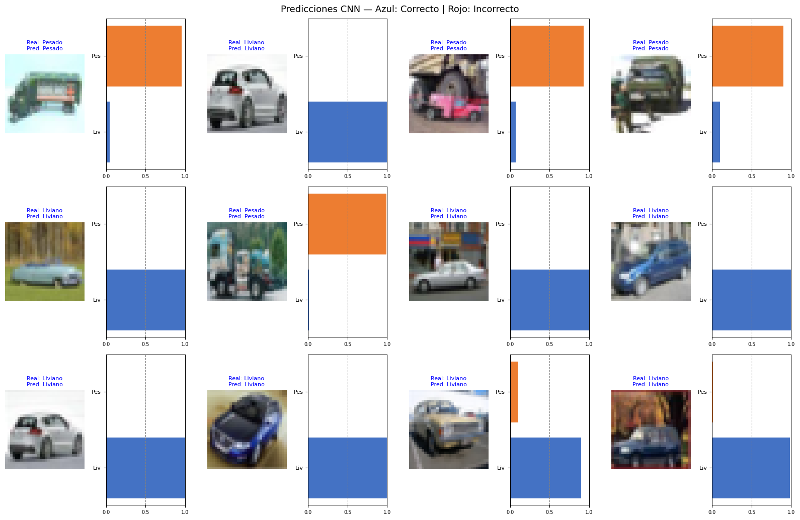
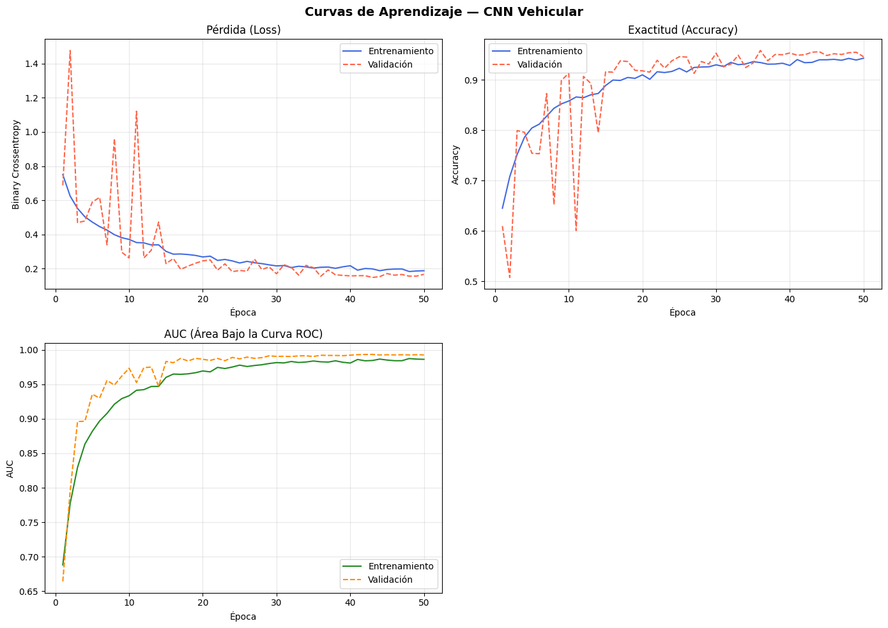
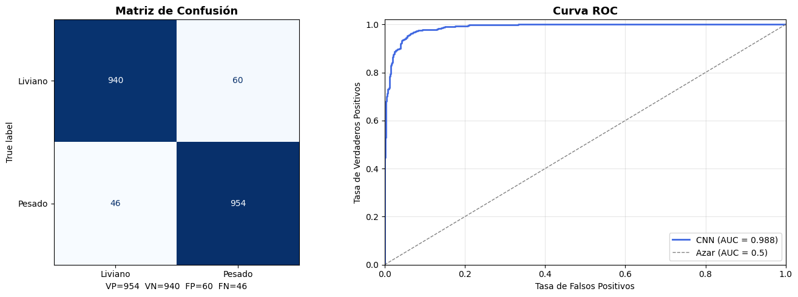
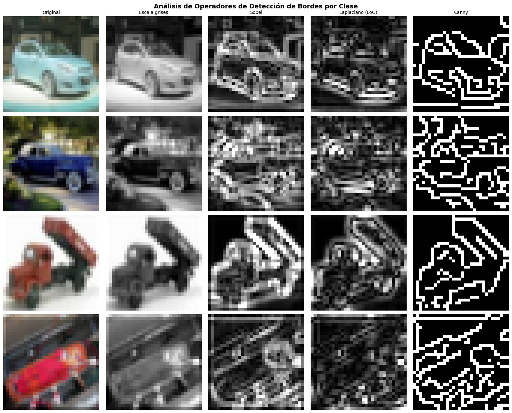
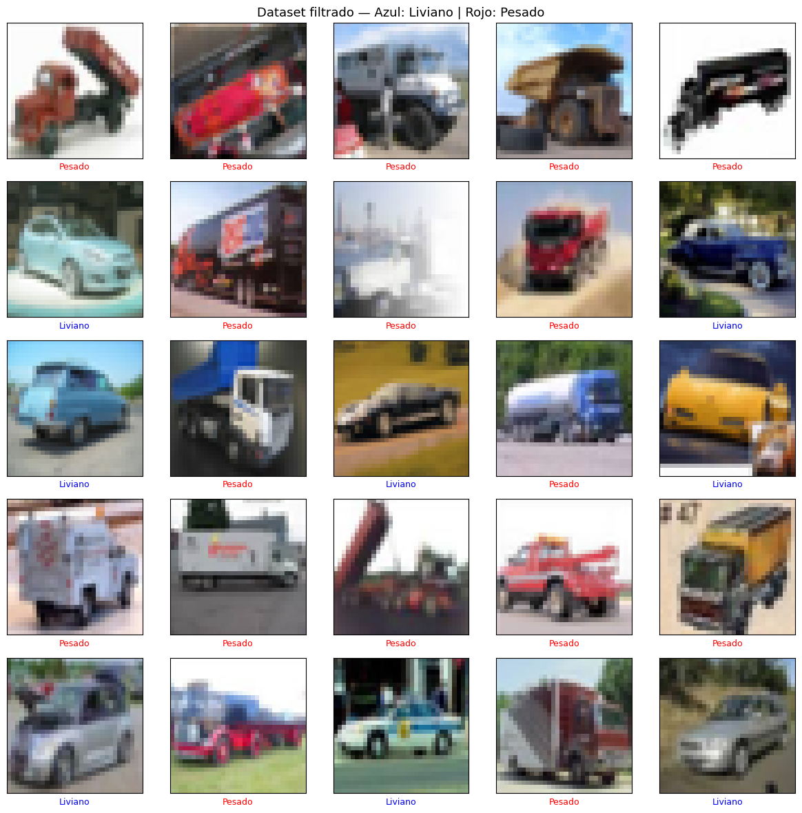
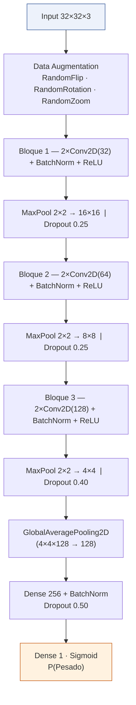
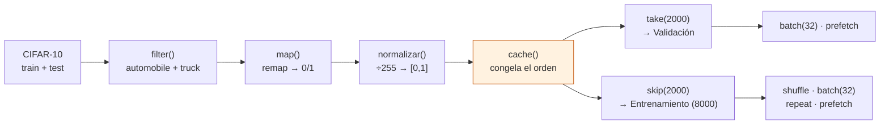
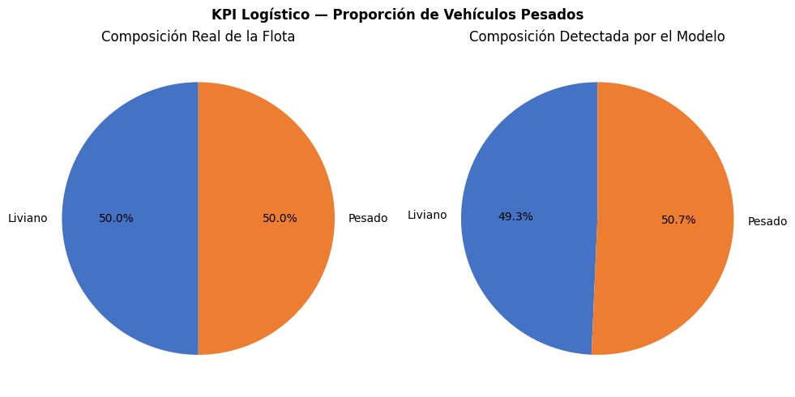
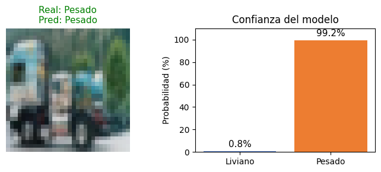

<div align="center">

# 🚛 Clasificador Vehicular CNN — Liviano vs. Pesado

### Detección automatizada de composición de flotas logísticas mediante Redes Neuronales Convolucionales

<p>
  
  
  
  
  
</p>

<p>
  
  
  
  
</p>

<br/>



<em>Clasificación binaria de vehículos sobre CIFAR-10 — 94.7% de accuracy y AUC-ROC de 0.988 en conjunto de prueba independiente</em>

</div>

<br/>

---

## 📑 Tabla de Contenidos

- [Descripción General](#-descripción-general)
- [Resultados Clave](#-resultados-clave)
- [Fundamentación: Análisis Morfológico](#-fundamentación-análisis-morfológico-previo)
- [Dataset](#️-dataset)
- [Arquitectura del Modelo](#️-arquitectura-del-modelo)
- [Pipeline de Datos](#️-pipeline-de-datos-tfdata)
- [Estrategia de Entrenamiento](#-estrategia-de-entrenamiento)
- [CNN vs. Baseline MLP](#-cnn-vs-baseline-mlp)
- [Validación Cualitativa](#-validación-cualitativa)
- [Instalación y Uso](#-instalación-y-uso)
- [Estructura del Repositorio](#-estructura-del-repositorio)
- [Documentación Adicional](#-documentación-adicional)
- [Stack Tecnológico](#️-stack-tecnológico)
- [Licencia](#-licencia)

---

## 📋 Descripción General

Este proyecto implementa un **clasificador binario de vehículos** (`Liviano` vs. `Pesado`) mediante una **Red Neuronal Convolucional (CNN)** entrenada sobre un subconjunto filtrado y reetiquetado de **CIFAR-10** (clases `automobile` y `truck`), utilizado como sustituto experimental de un dataset vehicular propio.

El caso de uso es logístico: estimar automáticamente, a partir de imágenes, la composición de una flota vehicular para aplicaciones como peajes diferenciados por tonelaje, estimación de desgaste vial o segmentación de mantenimiento predictivo.

> 💡 El proyecto incluye además un **análisis morfológico previo** con operadores de bordes clásicos (Sobel, LoG, Canny) que justifica empíricamente por qué una arquitectura convolucional entrenable supera a un enfoque de extracción de características fija — y a un Perceptrón Multicapa (MLP) baseline.

---

## 📊 Resultados Clave

| Métrica | Valor |
|---|:---:|
| **Accuracy** (test) | `94.70%` |
| **AUC-ROC** | `0.988` |
| **Precision** | `0.9408` |
| **Recall** | `0.9540` |
| **F1-score** | `0.9474` |
| **Loss (BCE)** | `0.1799` |
| Tamaño del conjunto de prueba | `2,000 imágenes` (balanceado 50/50) |

<div align="center">

<br/>
<em>Figura — Curvas de Pérdida, Exactitud y AUC a lo largo de 50 épocas (entrenamiento vs. validación)</em>
</div>

<br/>

<div align="center">

<br/>
<em>Figura — Matriz de Confusión (VP=954 · VN=940 · FP=60 · FN=46) y Curva ROC sobre el conjunto de prueba</em>
</div>

> 📄 El análisis detallado de cada curva, incluyendo por qué la pérdida de validación cae por debajo de la de entrenamiento (Data Augmentation + Dropout + regularización L2 activos solo en entrenamiento), está documentado en el **[Informe Técnico completo](#-documentación-adicional)**.

---

## 🔬 Fundamentación: Análisis Morfológico Previo

Antes de construir la CNN, se analizaron muestras de ambas clases con **operadores de detección de bordes clásicos** (Sobel, Laplaciano del Gaussiano y Canny), confirmando que existe una señal morfológica discriminante accesible mediante gradientes de intensidad — y exponiendo por qué esos filtros *fijos* son insuficientes frente a la variabilidad real de pose, escala e iluminación.

<div align="center">

<br/>
<em>Figura — Comparación de Sobel, LoG y Canny sobre muestras Liviano y Pesado</em>
</div>

**Hallazgo:** los vehículos `Liviano` muestran siluetas de perfil bajo con contornos curvos, mientras que los `Pesado` presentan geometría angular con cajas de carga rectangulares — el argumento central para justificar filtros convolucionales *entrenables* capaces de aprender estas invarianzas espaciales de forma automática.

---

## 🗂️ Dataset

- **Fuente:** CIFAR-10, clases `automobile` (→ `Liviano`, 0) y `truck` (→ `Pesado`, 1)
- **Entrenamiento:** 10,000 imágenes → split interno 80/20 (8,000 train / 2,000 validación)
- **Prueba:** 2,000 imágenes independientes, balanceadas 50/50
- **Resolución:** 32×32×3 (RGB)

<div align="center">

<br/>
<em>Figura — Muestra del dataset filtrado y reetiquetado (azul = Liviano, rojo = Pesado)</em>
</div>

---

## 🏗️ Arquitectura del Modelo

CNN secuencial de 3 bloques convolucionales con profundidad creciente (32→64→128 filtros), `GlobalAveragePooling2D` en lugar de `Flatten` para eficiencia paramétrica, y una cabeza densa regularizada:



<details>
<summary><strong>🔧 Decisiones de diseño clave (clic para expandir)</strong></summary>

<br/>

- **`padding='same'`** en cada `Conv2D`: mantiene las dimensiones espaciales constantes; solo `MaxPooling2D` controla la reducción de resolución (32→16→8→4).
- **`use_bias=False`**: redundante junto a `BatchNormalization`, que ya absorbe cualquier desplazamiento constante — ahorra parámetros sin costo alguno.
- **`kernel_regularizer=l2(1e-4)`**: penaliza pesos grandes en cada kernel convolucional, controlando la capacidad efectiva del modelo.
- **`GlobalAveragePooling2D`** vs. `Flatten`: reduce ~524K parámetros potenciales a ~33K en la conexión hacia la capa densa (~16× menos), clave dado que el set de entrenamiento real es de solo 8,000 imágenes.
- **Salida `Dense(1, sigmoid)`**: probabilidad única `P(Pesado)`, con `P(Liviano) = 1 - P(Pesado)`.

</details>

---

## ⚙️ Pipeline de Datos (`tf.data`)

Diseñado explícitamente para **prevenir Data Leakage** entre entrenamiento y validación:



**El detalle crítico:** el split `take`/`skip` se ejecuta **antes** del `shuffle`, sobre un dataset ya congelado por `.cache()`. Esto garantiza que el conjunto de validación sea idéntico en cada época — si el orden fuera inverso, ejemplos de validación podrían "filtrarse" al entrenamiento en épocas distintas.

- `num_parallel_calls=tf.data.AUTOTUNE` → paraleliza `.map()` dinámicamente según CPU disponible
- `.repeat()` solo en entrenamiento → permite controlar la época vía `steps_per_epoch`
- `.prefetch(tf.data.AUTOTUNE)` → solapa preprocesamiento en CPU con cómputo en GPU

---

## 🧪 Estrategia de Entrenamiento

| Callback | Configuración | Rol |
|---|---|---|
| `EarlyStopping` | `monitor='val_loss'`, `patience=8`, `restore_best_weights=True` | Detiene el entrenamiento y **restaura los mejores pesos** observados |
| `ReduceLROnPlateau` | `factor=0.5`, `patience=4`, `min_lr=1e-6` | Reduce la tasa de aprendizaje **antes** de que actúe EarlyStopping (patience menor) |
| `ModelCheckpoint` | `monitor='val_accuracy'`, `save_best_only=True` | Persiste el mejor modelo directamente en Google Drive |

```python
modelo.compile(
    optimizer=tf.keras.optimizers.Adam(learning_rate=1e-3),
    loss=tf.keras.losses.BinaryCrossentropy(),
    metrics=['accuracy', 'precision', 'recall', 'auc']
)
```

---

## 📈 CNN vs. Baseline MLP

| Modelo | Accuracy | AUC | Mejora |
|---|:---:|:---:|:---:|
| MLP (Evidencia 2, baseline) | ~70.0% | ~0.72 | — |
| **CNN (este proyecto)** | **94.70%** | **0.988** | **+24.7 pp** |

La mejora sustancial valida la hipótesis central del proyecto: el sesgo inductivo espacial de una CNN (campos receptivos locales + compartición de pesos) explota la estructura 2D de la imagen de forma muchísimo más eficaz que un MLP con entrada aplanada.

---

## 🔍 Validación Cualitativa

<div align="center">


<br/>
<em>Figura — Composición real de la flota (50/50) vs. composición detectada por el modelo (49.3% / 50.7%) — desviación de apenas 0.7 pp</em>

<br/><br/>


<br/>
<em>Figura — Inferencia end-to-end sobre una imagen individual: 99.2% de confianza en la clase correcta</em>

</div>

---

## 🚀 Instalación y Uso

### Opción 1 — Google Colab (recomendado)

<a href="https://colab.research.google.com/">
  
</a>

Sube `ev3_veh_classifier_cnn.ipynb` a Google Colab y ejecuta las celdas en orden. El notebook detecta automáticamente si ya existe un modelo entrenado guardado en Google Drive y, de ser así, lo carga en lugar de reentrenar.

### Opción 2 — Entorno local

```bash
# Clonar el repositorio
git clone https://github.com/<tu-usuario>/<tu-repositorio>.git
cd <tu-repositorio>

# Crear entorno virtual e instalar dependencias
python -m venv venv
source venv/bin/activate      # En Windows: venv\Scripts\activate
pip install -r requirements.txt

# Ejecutar el notebook
jupyter notebook ev3_veh_classifier_cnn.ipynb
```

**Dependencias principales:** `tensorflow`, `numpy`, `matplotlib`, `scikit-learn`, `opencv-python`, `tensorflow-datasets`

---


## 📄 Documentación Adicional

Este README ofrece una vista general del proyecto. El repositorio incluye además un **Informe Técnico y Metodológico completo** (`docs/Informe_Tecnico_Clasificador_Vehicular_CNN.docx`) con:

- Fundamentación matemática de Binary Crossentropy y Adam
- Explicación línea por línea de cada bloque de código
- Análisis exhaustivo de curvas, matriz de confusión y curva ROC
- Diagnóstico de advertencias de `tf.data` y verificación cruzada de métricas

---

## 🛠️ Stack Tecnológico

<p>
  
  
  
  
  
  
  
</p>

---
## Autor

**Mario Arce**
Técnico Superior en Inteligencia Artificial y Ciencia de Datos (ISPC)

- LinkedIn: https://www.linkedin.com/in/marioarce95/

---
## 📜 Licencia

Este proyecto se distribuye bajo la licencia **MIT**. Consulta el archivo `LICENSE` para más detalles.

<div align="center">
<br/>

⭐ Si este proyecto te resultó útil, considera dejar una estrella en el repositorio ⭐

</div>
